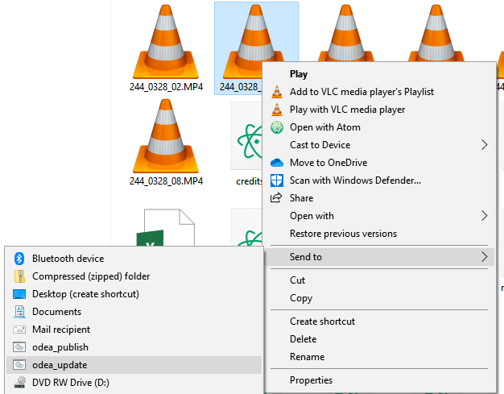

.. _installation:

Installation
==============

The following instructions assume that you are using either Ubuntu linux OR Ubuntu through the Windows Subsystem for Linux (Windows 10).

.. important::

   The described installation method for Windows requires Windows 10+. Direct installation on Mac OS is possible but not tested.

Enable WSL (Windows only)
---------------------------

On Windows, you will need to enable Windows Subsystem for Linux (wsl). Go to Control Panel > Programs > Programs and Features > Turn Windows Features On and Off, then check "Windows Subsystem for Linux".

Now go to the Windows start menu and type "Ubuntu", which should locate Ubuntu in the Windows App Store. Follow the prompts to install Ubuntu Linux and create a user account.

Run the installer script
-------------------------

Download :download:`odea_install.sh <../static/odea_install.sh>` and, if you are using Windows, the batch command script :download:`odea_install.cmd <../static/odea_install.cmd>`.

On Windows, put both files in the same directory and double-click the Windows install file (``odea_install.cmd``). On Linux, just run the bash file directly.

The Windows installer contains the following script:

.. literalinclude:: ../static/odea_install.cmd
   :language: bat

The shell script contains the following:

.. literalinclude:: ../static/odea_install.sh
   :language: sh

.. _drop-targets:

Odea drop targets
---------------------

The simplest way of using odea is through scripts that wrap the command-line interface.

The following provided scripts can be used as drop-targets for processing archive files, and can be stored anywhere on your computer that is convenient. Documents to be processed by odea simply need to be dragged and dropped onto the script file in the file explorer.

Windows version of the "update" script (:download:`odea_update.cmd <../static/odea_update.cmd>`):

.. literalinclude:: ../static/odea_update.cmd
   :language: bat

Linux version of the "update" script (:download:`odea_update.sh <../static/odea_update.sh>`):

.. literalinclude:: ../static/odea_update.sh
   :language: sh

If using the Publish script, you will need to update the variables at the top to suit your installation. Here is a Windows version of the "publish" script (:download:`odea_publish.cmd <../static/odea_publish.cmd>`):

.. literalinclude:: ../static/odea_publish.cmd
   :language: bat

Context menu scripts
-----------------------

It is also possible to add any of these scripts to the "Send To" context menu on Windows. To do so, type ``shell:sendto`` in the location bar of the File Explorer, then create shortcuts to the odea scripts in the folder that opens up.

